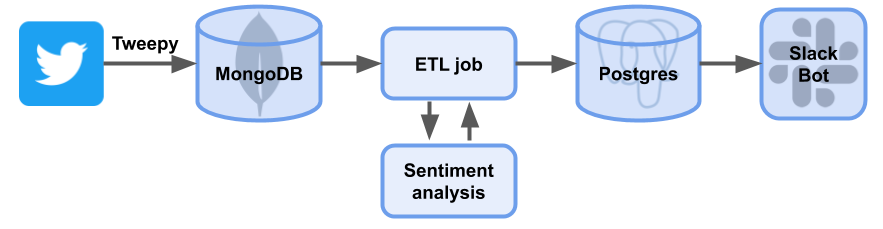

# Slack Bot

This programme extracts tweets based on key words, puts them in a Dockerized data pipeline, applies a sentiment score and sends them as Slack message. It uses Docker, Airflow, Postgres and MongoDB.

This project was developed in week 7 of the data science bootcamp at Spiced.

## To Do:

- more clean up
- more tests

